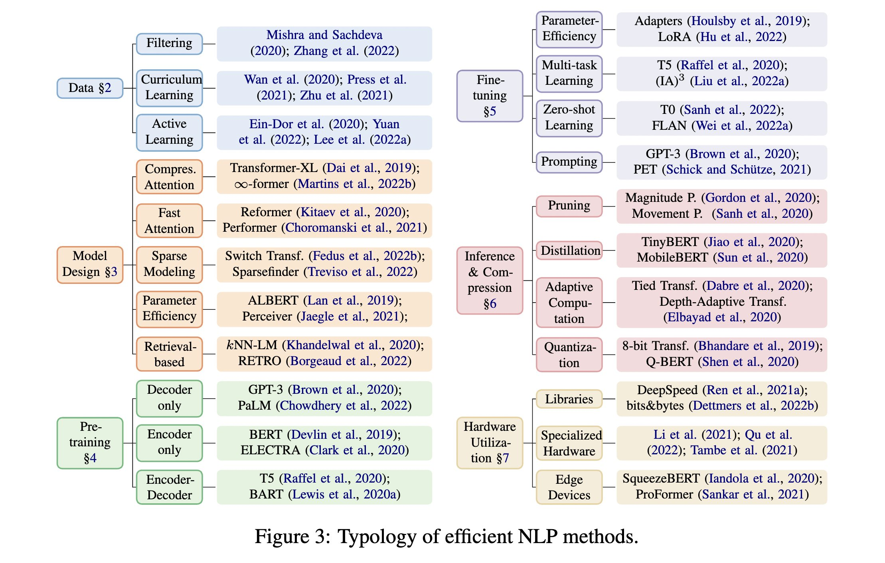

# Keeping Track of Affordable LLMs

- This repository is dedicated to organizing affordable but powerful language models (LLMs).
- The repository providing valuable insights into the latest models, including number of parameters, fine-tuning datasets and techniques, and hardware specifications.
- With this repository, you can quickly and easily access all the vital information you need for your affordable LLM needs.

## Base Models
- EleutherAI: GPT-J, GPT-NEO, GPT-NEOX, Pythia / Dolly
- huggingface BigScience: BLOOM / BELLE
- Meta: OPT, LLaMA / Alpaca, Vicuna
- Microsoft: DeepSpeedChat
- ColossalAI: ColossalChat
- Cerebras: Cerebras-GPT
- Google: BERT, T5, Flan, PaLM, LaMDA
- DeepMind: Chinchilla, Gopher, Sparrow
- Anthropic: Claude
- OpenAI: GPT-1, GPT-2, GPT-3, ChatGPT, GPT-4

## Model Spec

|project|base model|data|finetune|hardware/Cost|
|-------|-------------|-----|---------|----------|
|[Stanford/Alpaca](https://crfm.stanford.edu/2023/03/13/alpaca.html)|LLaMA-7B|52K instruction-followling dataset, generate in **self-instruct** style using text-davinci-003|SFT|3 hours on 8 80GB A100s, `$500(data) + $100(train)`|
|[NLPCloud/instruct-gpt-j](https://nlpcloud.com/instruct-version-of-gpt-j-using-stanford-alpaca-dataset.html)|GPT-J-6B|52K Alpaca|SFT|fp16 model deploy well on 16GB Tesla T4|
|[LianjiaTech/BELLE](https://github.com/LianjiaTech/BELLE)|BLOOMZ-7B1-mt|2M chinese data generated in a Alpaca way|SFT|8-bit **GPTQ** quantization using 12GB GPU|
|[LianjiaTech/BELLE](https://github.com/LianjiaTech/BELLE)|LLaMA-7B| same | SFT |4-bit **ggml** quantization work well on M1 chip Mac|
|[Alpaca-**LoRA**](https://github.com/tloen/alpaca-lora)|LLaMA-7B|52K Alpaca; update to MSFT LLaMA-GPT4 dataset |SFT with LoRA|hours on a single RTX 4090(24GB)|
|[Databricks/Dolly-v1-6B](https://github.com/databrickslabs/dolly)|GPT-J-6B|52K Alpaca|SFT|
|[Databricks/Dolly-v2-12B](https://www.databricks.com/blog/2023/04/12/dolly-first-open-commercially-viable-instruction-tuned-llm)|Pythia-12b|databricks-dolly-15k **generated by Databricks employees** in capability domains from the InstructGPT paper|SFT|about 3.5 hours on 8 V100s with fp16 to complete 1 epoch|
|[GPT4All](https://github.com/nomic-ai/gpt4all)|LLaMA-7B|~800k GPT-3.5-Turbo Generations|SFT with LoRA|
|[HIT&HFL/**Chinese-LLaMA-Alpaca**](https://github.com/ymcui/Chinese-LLaMA-Alpaca)|LLaMA-7B/13B| ahout 2M chinese and english dataset |add **20K chinese sentencepiece tokens** to vocab to improve chinese decoding effciency; using DeepSpeed Zero-2| pretrain on 20GB general chinese corpus on 16 A100s; SFT with LoRA on 16 A100s|
|[THUDM/ChatGLM-6B](https://github.com/THUDM/ChatGLM-6B)|
|[LLaMA-Adaptor](https://github.com/ZrrSkywalker/LLaMA-Adapter)|LLaMA-7B|52K Alpaca|SFT with LLaMA-Adaptor| reduce 3 hours to 1 hour, 1.2M instead of 7B |
|[FastChat/**Vicuna**](https://vicuna.lmsys.org/)|LLaMA-7B/13B|70K user-shared conversations gathered from ShareGPT.com|SFT, 40x larger dataset and 4x sequence length |4/8 A100s, $140/300 for training, **Impressing GPT-4 with ~90% ChatGPT Quality**|
|[BAIR/Koala](https://bair.berkeley.edu/blog/2023/04/03/koala/)|LLaMA-13B|Around 60K dialogues shared by users on ShareGPT; Human ChatGPT Comparison Corpus (HC3), Open Source Data...|SFT with JAX/Flax | 2 epochs in 6 hours using 8 A100s, beat ChatGPT on 180 real user queries|
|[Baize](https://github.com/project-baize/baize-chatbot)|LLaMA-7B/13B/30B|100k dialogs generated by letting ChatGPT chat with itself; QA and healthcare dataset |SFT with LoRA| run on A100(80GB)s|
|[Firefly](https://github.com/yangjianxin1/Firefly)|bloom-1b4/2b6-zh|1.1M instruction dataset build from 23 chinese NLP tasks, BELLE-0.5M-cn |reduce vocab from 25w to 4.6w, SFT|
|[Arxiv Chat](https://twitter.com/bhutanisanyam1/status/1643811531233148929)| | | build on ChatGPT(QA), LangChain(main logic) and h2oai(UI) |
|[huggingface/StackLLaMA](https://huggingface.co/blog/stackllama)|LLaMA-7B|Stack Exchange dataset(10M<N<100M)|SFT + RLHF|(2+8)*7B=70GB, 80GB A100 works fine, LoRA/PEFT makes 50-60B model works on a single A100 possible |
|[MSFT/LLaMA-GPT4](https://instruction-tuning-with-gpt-4.github.io/)|LLaMA-7B|52K Alpaca prompt input using GPT-4| SFT, RM|
|[MSFT/DeepSpeed Chat](https://github.com/microsoft/DeepSpeed/tree/master/blogs/deepspeed-chat)| | | support SFT, RM, RLHF | [Efficiency and Affordability](https://github.com/microsoft/DeepSpeed/tree/master/blogs/deepspeed-chat) |
|[ColossalAI/ColossalChat](https://github.com/hpcaitech/ColossalAI/tree/main/applications/Chat)| | | support SFT, RM, RLHF | [quick preview](https://github.com/hpcaitech/ColossalAI/tree/main/applications/Chat#quick-preview)|
|[Phoenix](https://github.com/FreedomIntelligence/LLMZoo)|LLaMA-7B/13B|vast collection of popular multilingual open source dataset| SFT |
|[MOSS-003](https://github.com/OpenLMLab/MOSS)|MOSS-16B|~1.1M text-davinci-003 generated self-instruct dataset, include ~300k plugins dataset as text-to-image/equations/.etc| SFT | fp16 finetune on 2 A100s or 4/8-bit finetune on single 3090 |

## References
- [Self-Instruct: Aligning Language Model with Self Generated Instructions, 2022/12, EDUs and AllenAI]
- [GPTQ: Accurate Post-Training Quantization for Generative Pre-trained Transformers, 2022/10, IST-DASLab]
- [ggml: https://github.com/ggerganov/llama.cpp, 2023/03]
- [LORA: LOW-RANK ADAPTATION OF LARGE LANGUAGE MODELS, 2021/06, MSFT]
- [PEFT: State-of-the-art Parameter-Efficient Fine-Tuning methods https://github.com/huggingface/peft]
- [LLaMA-Adapter: LLaMA-Adapter: Efficient Fine-tuning of Language Models with Zero-init Attention, 2023/03, Shanghai AI Lab]

## Fine-tune Stages
- SFT: Raw, LoRA, PEFT; Chinese Vocab Fixing; Instruction Dataset generated using ChatGPT/GPT4, Human labeled dataset like databricks-dolly-15k;
- RM: GPT-4 assign scores using its judging quality ability; Open Source Datasets;
- RLHF: DeepSpeedChat/ColossalChat;

## Typology of efficient NLP Model Training

- Data & Model Parallel ([torch-model-parallel](https://pytorch.org/tutorials/intermediate/model_parallel_tutorial.html), [huggingface-model-parallelism](https://huggingface.co/docs/transformers/v4.15.0/parallelism))
  - Data Parallel
  - Tensor Parallel
  - Pipeline Paralle
  - Zero Redundancy Optimizer(ZeRO) (DeepSpeed, often work with CPU offloading)
  - Sharded DDP(FSDP)

- Param Efficient
  - LoRA
  - 16-bit mix precision
  - 8-bit bitsandbytes/triton
  - 4-bit gptq/ggml